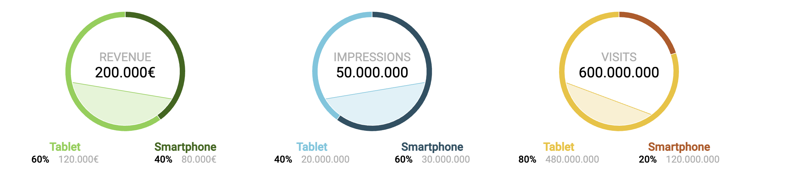

[![MIT License][license-shield]][license-url]
[![LinkedIn][linkedin-shield]][linkedin-url]

 

  <h1 align="center">Prueba Frontend</h1>

  

    Projecto creado por:   <strong> Jose Luis Chavez Guerra </strong>
     
    <a href="https://prueba-frontend-delta.vercel.app/"><strong>Ver Pagina »</strong></a>
     
     
    ·
    <a href="https://github.com/guerracode/prueba-frontend/issues">Report Bug</a>
    ·
    <a href="https://github.com/guerracode/prueba-frontend/issues">Request Feature</a>
  

<!-- ABOUT THE PROJECT -->

## Sobre el proyecto

El objetivo fue recrear una imagen muestra que tiene graficas y datos.  
Se uso PieChart y AreaChart para recrear las graficas.

### Construido con

Estas son las principales tecnologias usadas en el proyecto:

- JavaScript
- React
- Recharts
- Webpack
- Babel

## Resultado

<!-- GETTING STARTED -->

## Probar el proyecto

Se le hizo deploy al proyecto, por lo tanto se puede visualizar accediendo a esta [URL](https://prueba-frontend-delta.vercel.app/). 

### Correr en Local

- Descargar o clonar el proyecto.
- Instalar las dependencias con: 
  `npm install`
- Correr el proyecto con:   `npm run start`
- Se abrira el navegador con la pagina.
   

## Contact

Jose Luis Chavez - [@guerracode](https://twitter.com/guerracode) - josephsiul15@gmail.com

Project Link: [GitHub](https://github.com/guerracode/prueba-frontend)

<!-- LINKS -->

[license-shield]: https://img.shields.io/github/license/othneildrew/Best-README-Template.svg?style=flat-square
[license-url]: https://github.com/guerracode/To-Do/blob/master/LICENSE
[linkedin-shield]: https://img.shields.io/badge/-LinkedIn-black.svg?style=flat-square&logo=linkedin&colorB=555
[linkedin-url]: https://www.linkedin.com/in/jose-luis-chavez/
